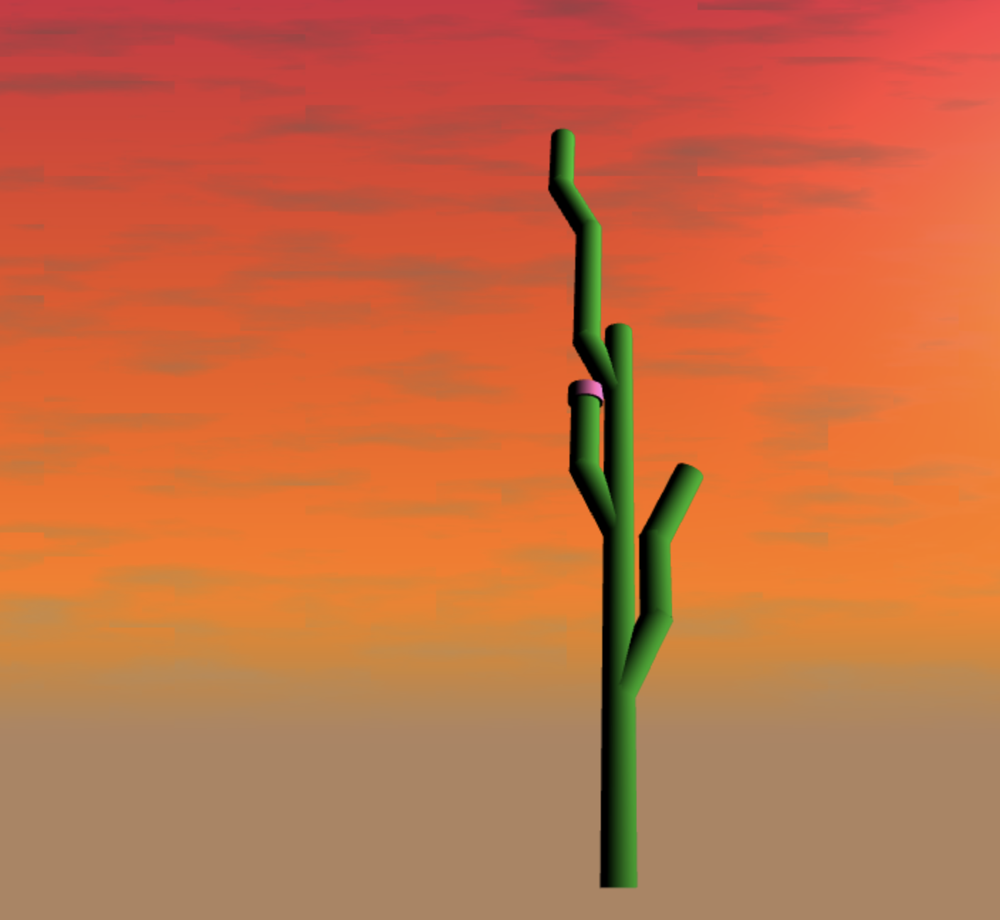

# Homework 4 - L-System

### Wendy Sun
- wentings

### Demo: 
- https://wentings.github.io/hw04-l-systems/

 

## References

For the background, I once again used the background I made in homework 3.
I have gotten a lot of help from the TAs and Adam on how to set up the l-system, which I found more difficult than what it as probably inhttp://pcgbook.com/wp-content/uploads/chapter05.pdftended. I also referred to this paper sometimes. 
- http://pcgbook.com/wp-content/uploads/chapter05.pdf

## Inspiration
Once I started playing with the l-system, I really liked the shape of the cactus. Here is reference image that I used. 

 

## Implementation

### L-System
To set up the l-system, I created an expansion rules class, a drawing rules class, and a turtles class all contained in the l system class. My expansion class uses different probablity expansion to create a varied look. For each move forward motion and add leaf, I push a transformation matrix onto a stack of all transformation, which are then passed to VBOs. Using instance VBO, the leaf and branches are placed in the scene.

## Future Improvements

I understand that my cactus right now looks a bit.. low poly, because the set up took much longer than I anticipated and I have much less time to work on the aesthetics than I thought. In the future, I would like to make these improvements:
 - make the branches expand in 3d
 - add noise to build more curved branches
 - import cactus branch and flower objs

 
